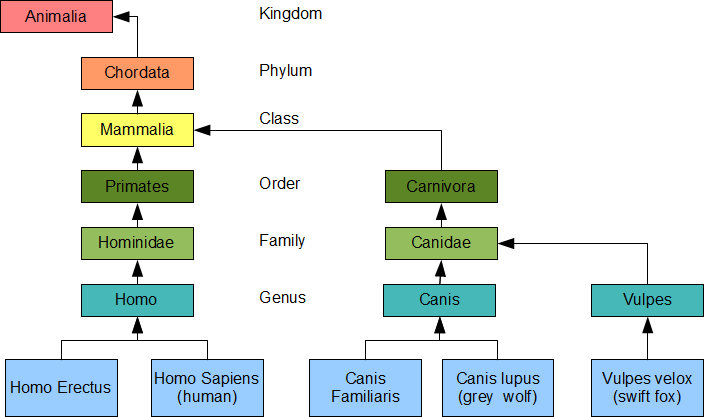
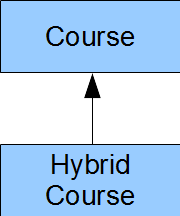
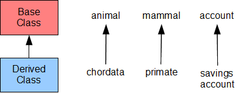
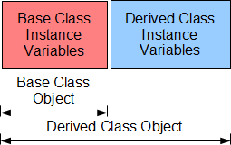

# Derived Classes

-   Relate classes using inheritance hierarchies to minimize the duplication of object code
-   Introduce the terminology and syntax of derived classes
-   Specify access to the protected members of a base class

> "Public inheritance must always model 'is-a' ('works-like-a')" **(Liskov, 1988)**
>
> "In correct inheritance, a derived class models a special case of a more general ... concept" **(Sutter, Alexandrescu, 2005)**

Object-oriented languages implement reusability of coding structure through inheritance. Inheritance is the second most prominent concept next to encapsulation. It refers to the relationship between classes where one class inherits the entire structure of another class. Inheritance is naturally hierarchical, a tighter relationship than composition and the most highly coupled relationship after friendship.

This chapter introduces the terminology used to describe an inheritance relationship and the syntax for defining a class that inherits the structure of another class. This chapter includes specification of accessibility privileges between classes within a hierarchy.

## Hierarchies

A comprehensive example of inheritance relationships is the Linnaean Hierarchy in Biology (a small portion is shown below). The Linnaean hierarchy relates all biological species in existence to one another. Proceeding from the bottom of the hierarchy, we identify a human as a Homo, which is a Hominidae, which is a Primate, which is a Mammal, which is a Chordata, which is an Animal. Similarly a dog is a Canis, which is a Canidae, which is a Carnivora, which is a Mammal, which is a Chordata, which is an Animal.



Carl Linnaeus earned himself the title of Father of Taxonomy after developing this hierarchy. He grouped the genera of Biology into higher taxa based on shared similarities. Using his taxa along with modern refinements, we say that the genus Homo, which includes the species Sapiens, belongs to the Family Hominidae, which belongs to the Order Primates, which belongs to the Class Mammalia, which belongs to the Phylum Chordata, which belongs to the Kingdom Animalia. For more details see the [University of Michigan Museum of Zoology's Animal Diversity Site](http://animaldiversity.ummz.umich.edu/site/accounts/information/Animalia.html).

### Inheritance in Hierarchies

Inheritance is a transitive structural relationship. A human inherits the structure of a Homo, which inherits the structure of a Hominoid, which inherits the structure of a Primate, which inherits the structure of a Mammal, which inherits the structure of a Chordata, which inherits the structure of an Animal.

Inheritance is not _commutative_. A Primate is an Animal, but an Animal is not necessarily a Primate: dogs and foxes are not Primates. Primates have highly developed hands and feet, shorter snouts and larger brains than dogs and foxes.

### Terminology

### "is a kind of"

The relative position of two classes in a hierarchy identifies their inheritance relationship. A class lower in the hierarchy _is a kind of_ the class that is higher in the hierarchy. For example, a dog _is a kind of_ canis, a fox _is a kind of_ vulpes and a human _is a kind of_ homo. In our course example from the first chapter, a `Hybrid Course` _is a kind of_ `Course`.

We depict an inheritance relationship by an arrow pointed to the inherited class.



The `Hybrid Course` class inherits the entire structure of the `Course` class.

### Derived and Base Classes

We call the child in an is-a-kind-of relationship the _derived class_ and we call the parent in the relationship the _base class_; that is, the `Hybrid Course` class is a derived class of the `Course` base class. A derived class is lower in the hierarchy, while its base class is higher in the hierarchy. The derived class inherits the entire structure of its base class.

The inheritance arrow extends from the derived class to the base class:



We depict an object of a derived class by placing its instance variables after the instance variables of its base class in the direction of increasing addresses in memory:



A derived class object contains the instance variables of the base class and those of the derived class, while a base class object only contains the instance variables of the base class.

The terms base class and derived class are C++ specific. Equivalent terms for these object-oriented concepts include:

-   **Base Class:** Super Class, Parent Class
-   **Derived Class:** Subclass, Heir Class, Child Class

### Inherited Structure

A derived class contains all of the instance variables and all of the normal member functions of its base class in addition to its own instance variables and member functions. A derived class does not inherit the base class' special functions: constructors, destructors or assignment operators. The term _normal member functions_ excludes these _special_ member functions.

## Definition of a Derived Class

The definition of a derived class takes the form

```cpp
class Derived : access Base {

    // ...

};
```

where `Derived` is the name of the derived class and `Base` is the name of the base class. `access` identifies the access that member functions of the derived class have to the non-private members of the base class. The default access is `private`. The most common access is `public`.

### Example

A `Student` is a kind of `Person`. Every `Person` has a name. Accordingly, let us derive our `Student` class from a `Person` class, where the `Person` class includes an instance variable that holds a name in the form of a character string.

The header file for our `Student` class contains our definitions of the base and derived classes:

```cpp
// Student.h

#include <iostream>
const int NC = 30;
const int NG  = 20;

class Person {                   // start of Base Class Definition
    char name[NC+1];
public:
    void set(const char* n);
    void displayName(std::ostream&) const;
};                              // end of Base Class Definition

class Student : public Person { // start of Derived Class Definition
    int no;
    float grade[NG];
    int ng;
public:
    Student();
    Student(int);
    Student(int, const float*, int);
    void display(std::ostream&) const;
};                              // end of Derived Class definition
```

The implementation file defines the member functions:

```cpp
// Student.cpp

#include <cstring>
#include "Student.h"
using namespace std;

void Person::set(const char* n) {
    strncpy(name, n, NC);
    name[NC] = '\0';
}

void Person::displayName(std::ostream& os) const {
    os << name << ' ';
}

Student::Student() {
    no = 0;
    ng = 0;
}

Student::Student(int n) {
    float g[] = {0.0f};
    *this = Student(n, g, 0);
}

Student::Student(int sn, const float* g, int ng_) {
    bool valid = sn > 0 && g != nullptr && ng_ >= 0;
    if (valid)
        for (int i = 0; i < ng_ && valid; i++)
            valid = g[i] >= 0.0f && g[i] <= 100.0f;

    if (valid) {
        // accept the client's data
        no = sn;
        ng = ng_ < NG ? ng_ : NG;
        for (int i = 0; i < ng; i++)
            grade[i] = g[i];
    } else {
        *this = Student();
    }
}

void Student::display(std::ostream& os) const {
    if (no > 0) {
        os << no << ":\n";
        os.setf(ios::fixed);
        os.precision(2);
        for (int i = 0; i < ng; i++) {
            os.width(6);
            os << grade[i] << endl;
        }
        os.unsetf(ios::fixed);
        os.precision(6);
    } else {
        os << "no data available" << endl;
    }
}
```

The following client code uses this implementation to produce the results on the right:

```cpp
// Derived Classes
// derived.cpp

#include <iostream>
#include "Student.h"

int main() {
    float gh[] = {89.4f, 67.8f, 45.5f};
    Student harry(1234, gh, 3);
    harry.set("Harry");           // inherited
    harry.displayName(std::cout); // inherited
    harry.display(std::cout);     // not inherited
}
```

```console
Harry 1234:
 89.40
 67.80
 45.50
```

Note that the `main()` function refers to the `Student` type, without referring to the `Person` type. Here, the hierarchy itself is invisible to the client code. We can upgrade the hierarchy without having to alter the client code in any way.

## Access

The C++ language supports three modifiers for granting access to the members of class:

-   `Private`: Bars all access
-   `Protected`: Limits access to derived classes only
-   `Public`: Unlimited access

Since the data member of the `Person` class is `private`, the member functions of our `Student` class and the client code cannot access that data member. Since the member functions of the `Person` and `Student` classes are public, the `main()` function can access all of them.

### Limiting Access to Derived Classes

The keyword `protected` limits access to members of a derived class.

For example, let us limit access to `displayName()` to classes derived for the `Person` class. Then, the `main()` function cannot call this member function and we must call it directly from `Student::display()`. The header file limits the access:

```cpp
// Student.h

#include <iostream>
const int NC = 30;
const int NG = 20;

class Person {
    char name[NC+1];
public:
    void set(const char* n);
protected:
    void displayName(std::ostream&) const;
};

class Student : public Person {
    int no;
    float grade[NG];
    int ng;
public:
    Student();
    Student(int);
    Student(int, const float*, int);
    void display(std::ostream&) const;
};
```

Our implementation of `Student::display()` calls `displayName()` directly:

```cpp
// Student.cpp

#include <cstring>
#include "Student.h"
using namespace std;

void Person::set(const char* n) {
    strncpy(name, n, NC); // validates length
    name[NC] = '\0';
}

void Person::displayName(std::ostream& os) const {
    os << name << ' ';
}

Student::Student() {
    no = 0;
    ng = 0;
}

Student::Student(int n) {
    float g[] = {0.0f};
    *this = Student(n, g, 0);
}

Student::Student(int sn, const float* g, int ng_) {
    bool valid = sn > 0 && g != nullptr && ng_ >= 0;
    if (valid)
        for (int i = 0; i < ng_ && valid; i++)
            valid = g[i] >= 0.0f && g[i] <= 100.0f;

    if (valid) {
        // accept the client's data
        no = sn;
        ng = ng_ < NG ? ng_ : NG;
        for (int i = 0; i < ng; i++)
            grade[i] = g[i];
    } else {
        *this = Student();
    }
}

void Student::display(std::ostream& os) const {
    if (no > 0) {
        displayName(os);
        os << no << ":\n";
        os.setf(ios::fixed);
        os.precision(2);
        for (int i = 0; i < ng; i++) {
            os.width(6);
            os << grade[i] << endl;
        }
        os.unsetf(ios::fixed);
        os.precision(6);
    } else {
        os << "no data available" << endl;
    }
}
```

We refer to `displayName()` directly without any scope resolution as if this function is a member of our Student class.

The following client code produces the output shown on the right:

```cpp
// Protected Access
// protected.cpp

#include <iostream>
#include "Student.h"

int main() {
    float gh[] = {89.4f, 67.8f, 45.5f};
    Student harry(1234, gh, 3);
    harry.set("Harry");           // inherited
    harry.display(std::cout);     // not inherited
}
```

```console
Harry 1234:
 89.40
 67.80
 45.50
```
### Avoid Granting Protected Access to Data Members

Granting data members protected access introduces a security hole.  If a derived class has protected access to any data member of its base class, any member function of the derived class can circumvent any validation procedure in the base class.  If the base class in the above example granted client code access to the `person` data member, we could change its contents from our `Student` class to a string of more than `NC` characters, which would probably break our `Student` object. 

### Good Design Tip

Granting `protected` access to any data member exposes that member to potential corruption and is considered poor design.  A protected read-only query is a preferable alternative to protected access to a data member.  The query does not allow any modification of the value in the data member.

## Summary

- Inheritance is a hierarchical relationship between classes. 
a derived class inherits the entire structure of its base class
- The access modifier protected grants access to member functions of the derived class
- Any member function of a derived class may access any protected or public member of its base class
- Keeping a data member private and accessing it through a protected query is good design