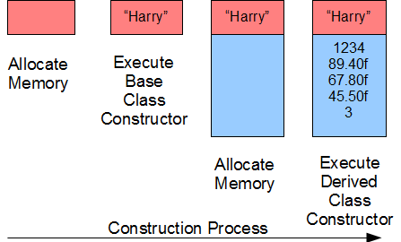
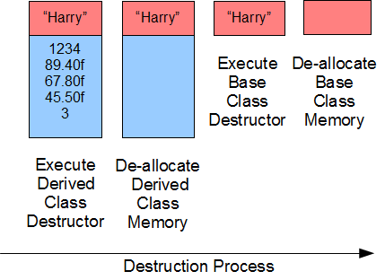

# Functions in a Hierarchy

-   Relate classes using inheritance hierarchies to minimize the duplication of object code
-   Shadow a base class function using a derived class function
-   Pass initialization data across the constructors of a class hierarchy

The logic that a derived class inherits from its base class is limited to the normal member functions of the base class. A derived class does not by default inherit the constructors, the destructor or the copy assignment operator - that is, the special member functions - of the base class. The special member functions in a class hierarchy define the logic for the creation, destruction and copying of different parts of an object and are necessarily different. A derived class' constructor automatically calls the base class' default constructor. A derived class' destructor automatically calls the base class' destructor. A derived class' copy assignment operator automatically calls the base class' copy assignment operator.

This chapter describes how member functions shadow one another in a hierarchy and the order in which constructors and destructors call one another. This chapter shows how to define a derived class' constructor to access a specific base class constructor and how to overload a helper operator for a derived class.

## Shadowing

A member function of a derived class `shadows` the base class member function with the same identifier. The C++ compiler binds a call to the member function of the derived class, if one exists.

To access the base class version of a member function that a derived class version has shadowed, we use scope resolution. A call to a shadowed function takes the form

```cpp
Base::identifier(arguments)
```

where `Base` identifies the class to which the shadowed function belongs.

### Example

Consider the following hierarchy. The base class and the derived class define distinct versions of the `display()` member function. The `Student` class version shadows the `Person` class version for any object of `Student` type:

```cpp
// Student.h

#include <iostream>
const int NC = 30;
const int NG = 20;

class Person {
    char name[NC+1];
public:
    void set(const char* n);
    void display(std::ostream&) const;
};

class Student : public Person {
    int no;
    float grade[NG];
    int ng;
public:
    Student();
    Student(int);
    Student(int, const float*, int);
    void display(std::ostream&) const;
};
```

We access the base class version from the derived version using scope resolution:

```cpp
// Student.cpp

#include <cstring>
#include "Student.h"
using namespace std::

void Person::set(const char* n) {
    strncpy(name, n, NC);
    name[NC] = '\0';
}

void Person::display(std::ostream& os) const {
    os << name << ' ';
}

Student::Student() {
    no = 0;
    ng = 0;
}

Student::Student(int n) {
    float g[] = {0.0f};
    *this = Student(n, g, 0);
}

Student::Student(int sn, const float* g, int ng_) {
    bool valid = sn > 0 && g != nullptr && ng_ >= 0;
    if (valid)
        for (int i = 0; i < ng_ && valid; i++)
            valid = g[i] >= 0.0f && g[i] <= 100.0f;

    if (valid) {
        // accept the client's data
        no = sn;
        ng = ng_ < NG ? ng_ : NG;
        for (int i = 0; i < ng; i++)
            grade[i] = g[i];
    } else {
        *this = Student();
    }
}

void Student::display(ostream& os) const {
    if (no > 0) {
        Person::display(os);
        os << no << ":\n";
        os.setf(ios::fixed);
        os.precision(2);
        for (int i = 0; i < ng; i++) {
            os.width(6);
            os << grade[i] << endl;
        }
        os.unsetf(ios::fixed);
        os.precision(6);
    } else {
        os << "no data available" << endl;
    }
}
```

The following client code produces the output shown on the right:

```cpp
// Shadowing
// shadowing.cpp

#include <iostream>
#include "Student.h"

int main() {
    Person jane;
    jane.set("Jane Doe");
    float gh[] = {89.4f, 67.8f, 45.5f};
    Student harry(1234, gh, 3);
    harry.set("Harry");           // inherited
    harry.display(std::cout);     // not inherited
    jane.display(std::cout);
    std::cout << std::endl;
}
```

```console
Harry 1234:
 89.40
 67.80
 45.50
Jane Doe
```

`harry.display(std::cout)` calls `Student::display()`, which calls the shadowed `Person::display()`, while jane.display() calls `Person::display()` directly. The derived version shadows the base version when called on `harry`.

### Good Design Tip

By calling `Person::display()` within `Student::display()`, we hide the hierarchy from the client code. The `main()` function is hierarchy agnostic.

### Exposing an Overloaded Member Function (Optional)

The C++ language shadows member functions on their identifier and not on their signature. To expose an overloaded member function in the base class with the same identifier but a different signature we insert a `using` declaration into the definition of the derived class. A `using` declaration takes the form

```cp
using Base::identifier;
```

where `Base` identifies the base class and `identifier` is the name of the shadowed function.

#### Example

Let us overload the `display()` member function in the `Person` class to take two arguments: a modifiable reference to the output stream and the address of a C-style null-terminated character string containing a prefix message. We insert the `using` declaration in the definition of the derived class to expose this member function and any other with the same identifier for objects of the derived class.

```cpp
// Student.h

#include <iostream>
const int NC = 30;
const int NG = 20;

class Person {
    char name[NC+1];
public:
    void set(const char* n);
    void display(std::ostream&) const;
    void display(std::ostream&, const char*) const;
};

class Student : public Person {
    int no;
    float grade[NG];
    int ng;
public:
    Student();
    Student(int);
    Student(int, const float*, int);
    void display(std::ostream&) const;
    using Person::display;
};
```

We define the overloaded `display()` function for the base class:

```cpp
// Student.cpp

#include <cstring>
#include "Student.h"
using namespace std;

void Person::set(const char* n) {
    strncpy(name, n, NC);
    name[NC] = '\0';
}

void Person::display(ostream& os) const {
    os << name << ' ';
}

void Person::display(ostream& os, const char* msg) const {
    os << msg << name << ' ';
}

Student::Student() {
    no = 0;
    ng = 0;
}

Student::Student(int n) {
    float g[] = {0.0f};
    *this = Student(n, nullptr, 0);
}

Student::Student(int sn, const float* g, int ng_) {
    bool valid = sn > 0 && g != nullptr && ng_ >= 0;
    if (valid)
        for (int i = 0; i < ng_ && valid; i++)
            valid = g[i] >= 0.0f && g[i] <= 100.0f;

    if (valid) {
        // accept the client's data
        no = sn;
        ng = ng_ < NG ? ng_ : NG;
        for (int i = 0; i < ng; i++)
            grade[i] = g[i];
    } else {
        *this = Student();
    }
}

void Student::display(ostream& os) const {
    if (no > 0) {
        Person::display(os);
        os << no << ":\n";
        os.setf(ios::fixed);
        os.precision(2);
        for (int i = 0; i < ng; i++) {
            os.width(6);
            os << grade[i] << endl;
        }
        os.unsetf(ios::fixed);
        os.precision(6);
    } else {
        os << "no data available" << endl;
    }
}
```

The following client produces the result shown on the right:

```cpp
// Overloading and Shadowing
// overloading.cpp

#include <iostream>
#include "Student.h"

int main() {
    Person jane;
    float gh[] = {89.4f, 67.8f, 45.5f};
    Student harry(1234, gh, 3);

    harry.set("Harry");
    harry.display(std::cout);
    harry.display(std::cout, "Name is ");
    std::cout << std::endl;
    jane.set("Jane Doe");
    jane.display(std::cout);
    std::cout << std::endl;
}
```

```console
Harry 1234:
 89.40
 67.80
 45.50
Name is Harry
Jane Doe
```

## Constructors

A derived class does not inherit a base class constructor by default. That is, if we do not declare a constructor in our definition of the derived class, the compiler inserts an empty no-argument constructor by default.

The compiler constructs an instance of the derived class in four steps in two distinct stages:

1. Construct the base class portion of the complete object
    1. Allocate memory for the instance variables in the order of their declaration
    2. Execute the base class constructor
2. Construct the derived class portion of the object
    1. Allocate memory for the instance variables in the order of their declaration
    2. Execute the derived class constructor



In our example, let us define a no-argument constructor for the base class. The header file declares the no-argument constructor:

```cpp
// Student.h

#include <iostream>
const int NC = 30;
const int NG = 20;

class Person {
    char name[NC+1];
public:
    Person();
    void set(const char* n);
    void display(std::ostream&) const;
};

class Student : public Person {
    int no;
    float grade[NG];
    int ng;
public:
    Student();
    Student(int);
    Student(int, const float*, int);
    void display(std::ostream&) const;
};
```

The implementation file defines the base class constructor:

```cpp
// Student.cpp

#include <cstring>
#include "Student.h"
using namespace std;

Person::Person() {
    cout << "Person()" << endl;
    name[0] = '\0';
}

void Person::set(const char* n) {
    cout << "Person(const char*)" << endl;
    strncpy(name, n, NC);
    name[NC] = '\0';
}

void Person::display(ostream& os) const {
    os << name << ' ';
}

Student::Student() {
    cout << "Student()" << endl;
    no = 0;
    ng = 0;
}

Student::Student(int n) {
    cout << "Student(int)" << endl;
    float g[] = {0.0f};
    *this = Student(n, g, 0);
}

Student::Student(int sn, const float* g, int ng_) {
    cout << "Student(int, const float*, int)" << endl;
    bool valid = sn > 0 && g != nullptr && ng_ >= 0;
    if (valid)
        for (int i = 0; i < ng_ && valid; i++)
            valid = g[i] >= 0.0f && g[i] <= 100.0f;

    if (valid) {
        // accept the client's data
        no = sn;
        ng = ng_ < NG ? ng_ : NG;
        for (int i = 0; i < ng; i++)
            grade[i] = g[i];
    } else {
        *this = Student();
    }
}

void Student::display(ostream& os) const {
    if (no > 0) {
        Person::display(os);
        os << no << ":\n";
        os.setf(ios::fixed);
        os.precision(2);
        for (int i = 0; i < ng; i++) {
            os.width(6);
            os << grade[i] << endl;
        }
        os.unsetf(ios::fixed);
        os.precision(6);
    } else {
        os << "no data available" << endl;
    }
}
```

The following client uses this implementation to produce the result shown below:

```cpp
// Derived Class Constructors
// derivedCtors.cpp

#include <iostream>
#include "Student.h"

int main() {
    Person jane;
    float gh[] = {89.4f, 67.8f, 45.5f};
    Student harry(1234, gh, 3);

    harry.set("Harry");
    harry.display(std::cout);

    jane.set("Jane");
    jane.display(std::cout);
}
```

```
Person()
Person()
Student(int, const float*, int);
Person(const char*);
Harry 1234:
 89.40
 67.80
 45.50
Person(const char*);
Jane
```

In this example, the compiler constructs the two objects as follows:

1. Allocates memory for `jane`
    1. Allocates memory for `person`
    2. The base class constructor initializes `person` to an empty string
2. Allocates memory for `harry` 1. Allocates memory for `name` 2. The base class constructor initializes `name` to an empty string
   allocates memory for `no`, `grade` and `ng` 3. The derived class constructor initializes: - `no` to `1234` - `grade` to `{89.40f, 67.80f, 45.50f}` - `ng` to `3`

### Passing Arguments to a Base Class Constructor

Each constructor of a derived class, other than the no-argument constructor, receives in its parameters all of the values passed by the client. Each constructor forwards the values for the base class part of the object to the base class constructor. The base class constructor uses the values received to build the base class part of the object. The derived class constructor uses the values received to complete building the derived class part of the object.

A call to the base class constructor from a derived class constructor that forwards values takes the form

```cpp
Derived( parameters ) : Base( arguments )
```

where `Derived` is the name of the derived class and `Base` is the name of the base class. The single colon separates the header of the derived-class constructor from its call to the base class constructor. If we omit this call, the compiler inserts a call to the default base class constructor.

#### Example

Let us replace the `set()` member function in the base class with a one-argument constructor and upgrade the `Student`'s three-argument constructor to receive the student's name. The header file declares a single-argument base class constructor and a four-argument derived class constructor:

```cpp
// Student.h

#include <iostream>
const int NC = 30;
const int NG = 20;

class Person {
    char name[NC+1];
public:
    Person();
    Person(const char*);
    void display(std::ostream&) const;
};

class Student : public Person {
    int no;
    float grade[NG];
    int ng;
public:
    Student();
    Student(int);
    Student(const char*, int, const float*, int);
    void display(std::ostream&) const;
};
```

The implementation of the single-argument constructor copies the name to the instance variable:

```cpp
// Student.cpp

#include <cstring>
#include "Student.h"
using namespace std;

Person::Person() {
    name[0] = '\0';
}

Person::Person(const char* nm) {
    strncpy(name, nm, NC);
    name[NC] = '\0';
}

void Person::display(ostream& os) const {
    os << name << ' ';
}

Student::Student() {
    no = 0;
    ng = 0;
}

Student::Student(int n) {
    float g[] = {0.0f};
    *this = Student("", n, g, 0);
}

Student::Student(const char* nm, int sn, const float* g, int ng_) : Person(nm) {
    bool valid = sn > 0 && g != nullptr && ng_ >= 0;
    if (valid)
        for (int i = 0; i < ng_ && valid; i++)
            valid = g[i] >= 0.0f && g[i] <= 100.0f;

    if (valid) {
        // accept the client's data
        no = sn;
        ng = ng_ < NG ? ng_ : NG;
        for (int i = 0; i < ng; i++)
            grade[i] = g[i];
    } else {
        *this = Student();
    }
}

void Student::display(ostream& os) const {
    if (no > 0) {
        Person::display(os);
        os << no << ":\n";
        os.setf(ios::fixed);
        os.precision(2);
        for (int i = 0; i < ng; i++) {
            os.width(6);
            os << grade[i] << endl;
        }
        os.unsetf(ios::fixed);
        os.precision(6);
    } else {
        os << "no data available" << endl;
    }
}
```

The following client uses this implementation to produce the output shown on the right:

```cpp
// Derived Class Constructors with Arguments
// drvdCtorsArgs.cpp

#include <iostream>
#include "Student.h"

int main() {
    Person jane("Jane");
    float gh[] = {89.4f, 67.8f, 45.5f};
    Student harry("Harry", 1234, gh, 3);

    harry.display(std::cout);
    jane.display(std::cout);
}
```

```
Harry 1234:
 89.40
 67.80
 45.50
Jane
```

### Inheriting Base Class Constructors (Optional)

C++11 introduced syntax for inheriting a base class constructor in cases where the derived class constructor does not execute any logic on the instance variables of the derived class and only passes to the base class constructor values received from the client. In such cases, the derived class may inherit the base class constructors.

The declaration for inheriting a base class constructor takes the form:

```cpp
using Base::Base;
```

where `Base` is the name of the base class.

#### Example

Let us derive an `Instructor` class from the `Person` base class and inherit all of the constructors of the base class. The header file overrides the no-inheritance default:

```cpp
// Student.h

// compiles with GCC 4.8 or greater or equivalent

#include <iostream>
const int NC = 30;
const int NG = 20;

class Person {
    char name[NC+1];
public:
    Person();
    Person(const char*);
    void display(std::ostream&) const;
};

class Student : public Person {
    int no;
    float grade[NG];
    int ng;
public:
    Student();
    Student(int);
    Student(const char*, int, const float*, int);
    void display(std::ostream&) const;
};

class Instructor : public Person {
public:
    using Person::Person;
};
```

The implementation file remains unchanged. The following client uses this new class definition to produce the output shown on the right:

```cpp
// Inherited Constructors
// inheritCtors.cpp

#include <iostream>
#include "Student.h"

int main() {
    Instructor john("John");
    Person jane("Jane");
    float gh[] = {89.4f, 67.8f, 45.5f};
    Student harry("Harry", 1234, gh, 3);
    john.display(std::cout);
    std::cout << std::endl;
    harry.display(std::cout);
    jane.display(std::cout);
}
```

```console
 John
 Harry 1234:
  89.40
  67.80
  45.50
 Jane
```

## Destructors

A derived class does not inherit the destructor of its base class. Destructors execute in opposite order to the order of their object's construction. That is, the derived class destructor always executes before the base class destructor.



### Example

Let us define destructors for our base and derived classes that insert tracking messages to standard output. We declare each destructor in its class definition:

```cpp
// Student.h

#include <iostream>
const int NC = 30;
const int NG = 20;

class Person {
    char name[NC+1];
public:
    Person();
    Person(const char*);
    ~Person();
    void display(std::ostream&) const;
};

class Student : public Person {
    int no;
    float grade[NG];
    int ng;
public:
    Student();
    Student(int);
    Student(const char*, int, const float*, int);
    ~Student();
    void display(std::ostream&) const;
};
```

We specify the messages in the destructor definitions:

```cpp
// Student.cpp

#include <cstring>
#include "Student.h"
using namespace std;

Person::Person() {
    name[0] = '\0';
}

Person::Person(const char* nm) {
    strncpy(name, nm, NC);
    name[NC] = '\0';
}

Person::~Person() {
    std::cout << "Leaving " << name << std::endl;
}

void Person::display(ostream& os) const {
    os << name << ' ';
}

Student::Student() {
    no = 0;
    ng = 0;
}

Student::Student(int n) {
    float g[] = {0.0f};
    *this = Student("", n, g, 0);
}

Student::Student(const char* nm, int sn, const float* g, int ng_) : Person(nm) {
    bool valid = sn > 0 && g != nullptr && ng_ >= 0;
    if (valid)
        for (int i = 0; i < ng_ && valid; i++)
            valid = g[i] >= 0.0f && g[i] <= 100.0f;

    if (valid) {
        // accept the client's data
        no = sn;
        ng = ng_ < NG ? ng_ : NG;
        for (int i = 0; i < ng; i++)
            grade[i] = g[i];
    } else {
        *this = Student();
    }
}

Student::~Student() {
    std::cout << "\nLeaving " << no << std::endl;
}

void Student::display(ostream& os) const {
    if (no > 0) {
        Person::display(os);
        os << no << ":\n";
        os.setf(ios::fixed);
        os.precision(2);
        for (int i = 0; i < ng; i++) {
            os.width(6);
            os << grade[i] << endl;
        }
        os.unsetf(ios::fixed);
        os.precision(6);
    } else {
        os << "no data available" << endl;
    }
}
```

The following client uses this implementation to produce the output shown below:

```cpp
// Derived Class Destructors
// drvdDtors.cpp

#include <iostream>
#include "Student.h"

int main() {
    Person jane("Jane");
    float gh[] = {89.4f, 67.8f, 45.5f};
    Student harry("Harry", 1234, gh, 3);

    harry.display(std::cout);
    jane.display(std::cout);
}
```

```
Harry 1234:
 89.40
 67.80
 45.50
Jane
Leaving 1234
Leaving Harry
Leaving Jane
```

## Helper Operators (Optional)

Helper functions support the classes identified by their parameter types. Each helper function is dedicated to the class that it supports. The compiler binds a call to a helper function on the basis of its parameter type(s). That is, the helper functions of a base class do not directly support classes derived from the supported base class.

Example

Let us upgrade our `Student` class to include overloads of the insertion and extraction operators for both base and derived classes. The header file contains:

```cpp
 // Student.h

 #include <iostream>
 const int NC = 30;
 const int NG = 20;

 class Person {
     char name[NC+1];
   public:
     Person();
     Person(const char*);
     void display(std::ostream&) const;
 };
 std::istream& operator>>(std::istream&, Person&);
 std::ostream& operator<<(std::ostream&, const Person&);

 class Student : public Person {
     int no;
     float grade[NG];
     int ng;
   public:
     Student();
     Student(int);
     Student(const char*, int, const float*, int);
     void read(std::istream&);
     void display(std::ostream&) const;
 };
 std::istream& operator>>(std::istream&, Student&);
 std::ostream& operator<<(std::ostream&, const Student&);
```

The implementation file defines the helper operators:

```cpp
// Student.cpp

#include <cstring>
#include "Student.h"
using namespace std;

Person::Person() {
    name[0] = '\0';
}

Person::Person(const char* nm) {
    strncpy(name, nm, NC);
    name[NC] = '\0';
}

void Person::display(ostream& os) const {
    os << name << ' ';
}

istream& operator>>(istream& is, Person& p) {
    char name[NC+1];
    cout << "Name: ";
    is.getline(name, NC+1);
    p = Person(name);
    return is;
}

std::ostream& operator<<(ostream& os, const Person& p) {
    p.display(os);
    return os;
}

Student::Student() {
    no = 0;
    ng = 0;
}

Student::Student(int n) {
    float g[] = {0.0f};
    *this = Student("", n, g, 0);
}

Student::Student(const char* nm, int sn, const float* g, int ng_) : Person(nm) {
    bool valid = sn > 0 && g != nullptr && ng_ >= 0;
    if (valid)
        for (int i = 0; i < ng_ && valid; i++)
            valid = g[i] >= 0.0f && g[i] <= 100.0f;

    if (valid) {
        // accept the client's data
        no = sn;
        ng = ng_ < NG ? ng_ : NG;
        for (int i = 0; i < ng; i++)
            grade[i] = g[i];
    } else {
        *this = Student();
    }
}

void Student::display(std::ostream& os) const {
    if (no > 0) {
        Person::display(os);
        os << no << ":\n";
        os.setf(ios::fixed);
        os.precision(2);
        for (int i = 0; i < ng; i++) {
            os.width(6);
            os << grade[i] << endl;
        }
        os.unsetf(ios::fixed);
        os.precision(6);
    } else {
        os << "no data available" << endl;
    }
}

void Student::read(istream& is) {
    char name[NC + 1]; // will hold the student's name
    int no;            // will hold the student's number
    int ng;            // will hold the number of grades
    float grade[NG];   // will hold the grades

    std::cout << "Name: ";
    is.getline(name, NC+1);
    cout << "Student Number : ";
    is >> no;
    cout << "Number of Grades : ";
    is >> ng;
    if (ng > NG) ng = NG;
    for (int i = 0; i < ng; i++) {
        cout << "Grade " << i + 1 << " : ";
        is >> grade[i];
    }

    // construct a temporary Student
    Student temp(name, no, grade, ng);
    // if data is valid, the temporary object into the current object
    if (temp.no != 0)
        *this = temp;
}

istream& operator>>(istream& is, Student& s) {
    s.read(is);
    return is;
}

ostream& operator<<(ostream& os, const Student& s) {
    s.display(os);
    return os;
}
```

The following client uses this implementation to produce the output shown on the right:

```cpp
// Helpers to Derived Classes
// drvdHelpers.cpp

#include <iostream>
#include "Student.h"

int main() {
    Person jane;
    Student harry;

    std::cin >> jane;
    std::cin >> harry;
    std::cout << jane << std::endl;
    std::cout << harry << std::endl;
}
```

```console
Name: Jane Doe
Name: Harry
Student Number : 1234
Number of Grades : 3
Grade 1 : 89.40
Grade 2 : 67.80
Grade 3 : 45.50
Jane Doe
Harry 1234
 89.40
 67.80
 45.50
```

## Summary

-   A member function of a derived class shadows an identically named member function of a base class
-   A derived class does not inherit the destructor, assignment operators or helper functions of a base class
-   A derived class does not by default inherit the constructor of a base class, but we may add syntax to allow inheritance where the derived class constructor does not contain logic to set its instance variables
-   Constructors in an inheritance hierarchy execute in order from the base class to the derived class
-   Destructors in an inheritance hierarchy execute in order from the derived class to the base class
